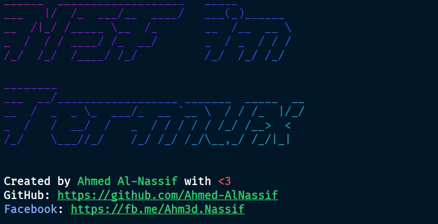

# Metasploit Framework Installation Script for Termux



## Introduction

This script automates the installation of the Metasploit Framework on Termux, a terminal emulator for Android. Metasploit is a powerful tool used for penetration testing, vulnerability research, and exploitation development. This guide will help you set up Metasploit quickly and efficiently.

## Features

- **Automated Updates**: Ensures your Termux environment is up to date.
- **Dependency Installation**: Installs all required packages for Metasploit.
- **Metasploit Fetching**: Downloads and extracts the latest Metasploit Framework.
- **Ruby Configuration**: Manages Ruby installations and configurations.
- **Seamless Integration**: Sets up Metasploit commands (`msfconsole`, `msfvenom`, `msfdb`, `msfrpcd`) to run directly from the terminal.

## Prerequisites

- A device running Android with Termux installed.
- An internet connection to download packages and Metasploit.

## Installation Steps

### Step 1: Download the Script

Clone the repository or download the script manually:

```bash
git clone https://github.com/Ahmed-AlNassif/Metasploit-Termux-Installer.git
cd Metasploit-Termux-Installer
```

### Step 2: Make the Script Executable

```bash
chmod +x install_metasploit.sh
```

### Step 3: Run the Script

```bash
./install_metasploit.sh
```

## Script Breakdown

### Banner Display

Displays a custom banner with contact information.

```bash
function banner() {
  cat logo.txt 2> /dev/null
  echo -e "\033[1;37mCreated by \033[32mAhmed Al-Nassif\033[37m with \033[31m<3\033[0m"
  echo -e "\033[1;37mGitHub: \033[4;32mhttps://github.com/Ahmed-AlNassif\033[0m"
  echo -e "\033[1;34mFacebook\033[37m: \033[4;32mhttps://fb.me/Ahm3d.Nassif\033[0m"
}
```

### Update and Upgrade Packages

Ensures all packages are up to date.

```bash
function update() {
  echo -e "\033[1;34m[*] \033[37mUpdate and upgrade the packages...\[033[0m"
  apt update
  apt list --upgradable
  echo -n -e "\033[1;33m[?]\033[37m Do you want to upgrade? [Y|N]: \033[32m"
  read answer
  echo -n -e "\033[0m"
  if [[ "${answer^^}" == "Y" || "${answer^^}" == "YES" ]]; then
    apt full-upgrade
  fi
}
```

### Install Required Packages

Installs all necessary dependencies for Metasploit.

```bash
function packages() {
  echo -e "\033[1;34m[*] \033[37mInstalling the requirements.\033[0m"
  pkgs="binutils python autoconf bison clang coreutils curl findutils apr apr-util postgresql openssl readline libffi libgmp libpcap libsqlite libgrpc libtool libxml2 libxslt ncurses make ncurses-utils ncurses git wget unzip zip tar termux-tools termux-elf-cleaner pkg-config git ruby"
  for pkg in $pkgs
  do
    echo -e "\033[1;31m\$ \033[34mapt \033[35minstall \033[32m $pkg\033[0m"
    echo -n -e "\033[1;37m"
    apt install "$pkg" -y
    echo -n -e "\033[0m"
  done
}
```

### Fetch Metasploit Framework

Downloads and extracts the latest version of Metasploit.

```bash
function fetch_msf() {
  echo -e "\033[1;34m[*] \033[37mFetching Metasploit-Framework...\033[033[0m"
  url="https://github.com/rapid7/metasploit-framework/archive/refs/heads/master.zip"
  file_name="msf.zip"
  echo -n -e "\033[1;32m"
  curl -L -o "$file_name" "$url"
  echo -n -e "\033[0m"
  if [[ $? != 0 ]]; then
    echo -e "\033[1;33m[!] \033[37mDownloading the file failed. Do you want to retry Downloading it? [Y|N]:\033[32m "
    read answer
    echo -n -e "\033[0m"
    if [[ "${answer^^}" == "Y" || "${answer^^}" == "YES" ]]; then
      fetch_msf
    else
      exit 1
    fi
  fi
  unzip "$file_name" &> /dev/null
  if [[ $? != 0 ]]; then
    echo -e "\033[1;33m[!] \033[37mThe file is corrupt. Do you want to retry Downloading it? [Y|N]:\033[32m "
    read answer
    echo -n -e "\033[0m"
    if [[ "${answer^^}" == "Y" || "${answer^^}" == "YES" ]]; then
      rm -f "$file_name"
      fetch_msf
    else
      exit 1
    fi
  fi
}
```

### Uninstall Ruby

Optionally uninstalls Ruby if needed.

```bash
function uninstall_ruby() {
  echo -e "\033[1;34m[*] \033[37mUninstalling Ruby..\033[0m"
  echo -n -e "\033[1;33m[?]\033[37m Do you want to uninstall Ruby? [Y|N]: \033[32m"
  read answer
  echo -n -e "\033[0m"
  if [[ "${answer^^}" == "Y" || "${answer^^}" == "YES" ]]; then
    apt autoremove ruby -y
    rm -rf ${PREFIX}/lib/ruby
  fi
}
```

### Install Metasploit Framework

Installs Metasploit and sets up necessary symlinks.

```bash
function install_msf() {
  path="${PREFIX}/opt/metasploit-framework"
  unziped_file="metasploit-framework-master"
  if [[ -d "$path" ]]; then
    echo -n -e "\033[1;33m[?]\033[37m MSF installed in $path. Do you want to remove it? [Y|N]: \033[32m"
    read answer
    echo -n -e "\033[0m"
    if [[ "${answer^^}" == "Y" || "${answer^^}" == "YES" ]]; then
      rm -rf "$path"
      mv "$unziped_file" "$path"
    fi
  else
    mv "$unziped_file" "$path"
  fi
  gem install bundler
  cd "$path"
  bundle config set documentation false
  NOKOGIRI_VERSION=$(cat Gemfile.lock | grep -i nokogiri | sed 's/nokogiri [\(\)]/(/g' | cut -d ' ' -f 5 | grep -oP "(.).[[:digit:]][\w+]?[.].")
  gem install nokogiri -v $NOKOGIRI_VERSION -- --with-cflags="-Wno-implicit-function-declaration -Wno-deprecated-declarations -Wno-incompatible-function-pointer-types" --use-system-libraries
  bundle install -j$(nproc --all)
  bundle update --bundler

  ln -sf "${PREFIX}/opt/metasploit-framework/msfconsole" "${PREFIX}/bin/"
  ln -sf "${PREFIX}/opt/metasploit-framework/msfvenom" "${PREFIX}/bin/"
  ln -sf "${PREFIX}/opt/metasploit-framework/msfrpcd" ${PREFIX}/bin/
  ln -sf "${PREFIX}/opt/metasploit-framework/msfdb" "${PREFIX}/bin/"

  echo -e "\033[1;32m[+] \033[37mCongratulations, the installation has completed successfully.\033[0m"
  echo -e "\033[1;34m[*] \033[37mYou can run: \033[32mmsfconsole\033[37m, \033[32mmsfvenom\033[37m, \033[32mmsfdb\033[37m, \033[32mmsfrpcd \033[37mfrom your terminal.\033[0m"
}
```

## License

This project is licensed under the MIT License.

## Contact

- **Author**: Ahmed Al-Nassif
- **GitHub**: [Ahmed-AlNassif](https://github.com/Ahmed-AlNassif)
- **Facebook**: [Ahm3d.Nassif](https://fb.me/Ahm3d.Nassif)

## Contributing

Contributions are welcome! Please fork the repository, create a feature branch, and submit a pull request with your changes.
