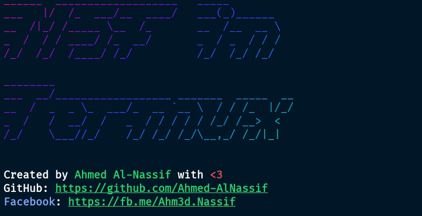

# Metasploit Framework Installation Script for Termux



## Introduction

This script automates the installation of the Metasploit Framework on Termux, a terminal emulator for Android. Metasploit is a powerful tool used for penetration testing, vulnerability research, and exploitation development. This guide will help you set up Metasploit quickly and efficiently.

## Features

- **Automated Updates**: Ensures your Termux environment is up to date.
- **Dependency Installation**: Installs all required packages for Metasploit.
- **Metasploit Fetching**: Downloads and extracts the latest Metasploit Framework.
- **Ruby Configuration**: Manages Ruby installations and configurations.
- **Seamless Integration**: Sets up Metasploit commands (`msfconsole`, `msfvenom`, `msfdb`, `msfrpcd`) to run directly from the terminal.

## Prerequisites

- A device running Android with Termux installed.
- An internet connection to download packages and Metasploit.

## Installation Steps

### Step 1: Download the Script

Clone the repository or download the script manually:

```bash
git clone https://github.com/Ahmed-AlNassif/Metasploit-Termux-Installer.git
cd Metasploit-Termux-Installer
```

### Step 2: Make the Script Executable

```bash
chmod +x install_metasploit.sh
```

### Step 3: Run the Script

```bash
./install_metasploit.sh
```

## License

This project is licensed under the MIT License.

## Contact

- **Author**: Ahmed Al-Nassif
- **GitHub**: [Ahmed-AlNassif](https://github.com/Ahmed-AlNassif)
- **Facebook**: [Ahm3d.Nassif](https://fb.me/Ahm3d.Nassif)

## Contributing

Contributions are welcome! Please fork the repository, create a feature branch, and submit a pull request with your changes.
